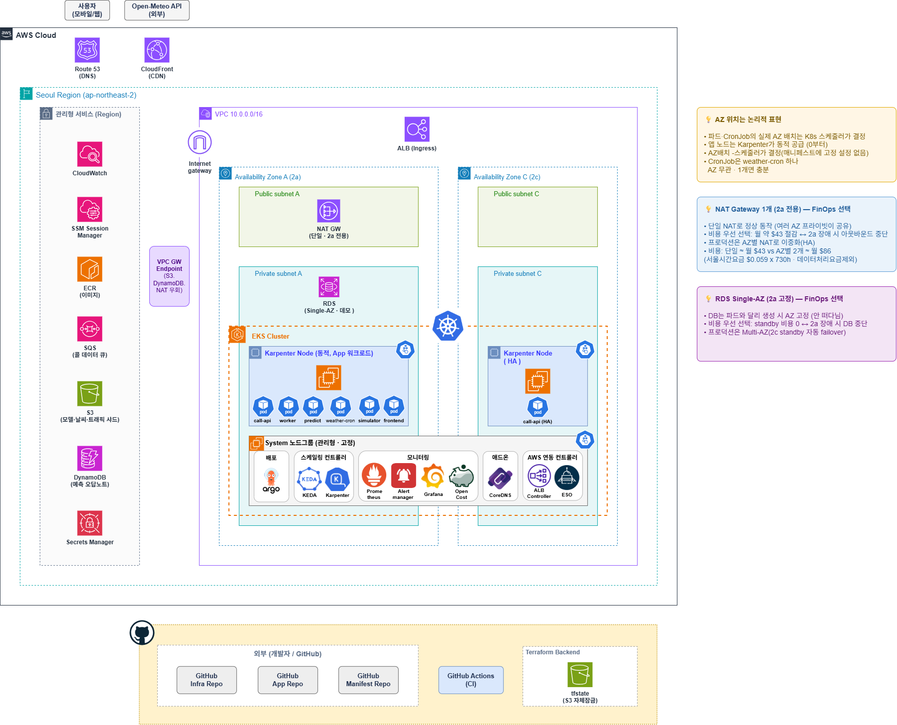
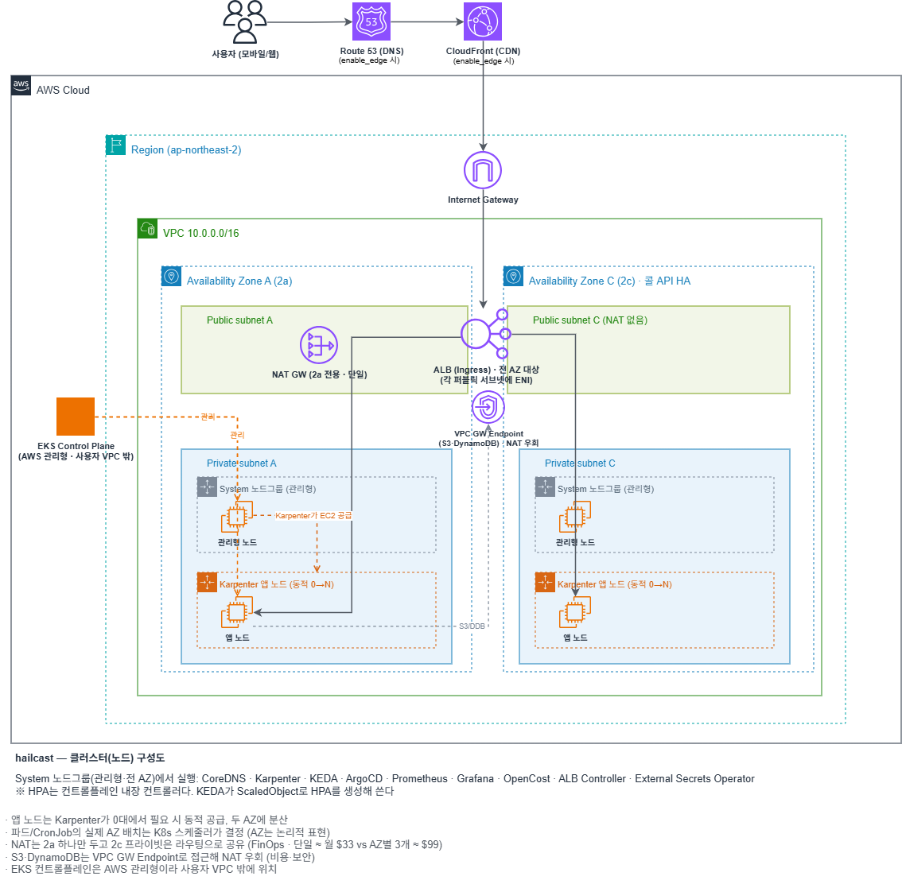
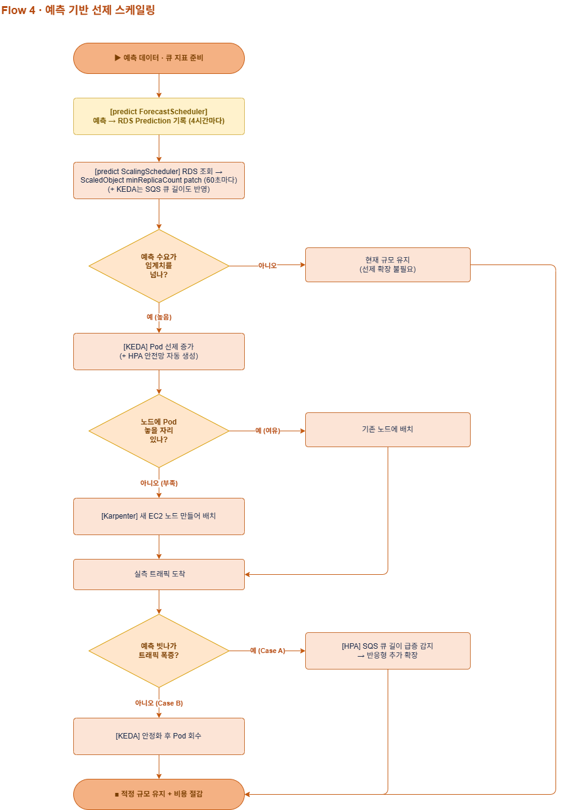

# project3-hailcast-infra

> hailcast: AI 수요 예측 기반 예측형 오토스케일링과 FinOps 프로젝트의 Terraform(IaC) 레포
> Org `ThisPod-ThatPod` / 리전 `ap-northeast-2`(서울) / 담당 이미선

## 1. 무엇을 만드는 레포인가

날씨와 시간 패턴으로 택시 호출 수요를 미리 예측해, 트래픽이 몰리기 전에 파드를 늘리고
한산해지면 회수하는 시스템의 AWS 토대를 Terraform으로 만든다.

```
관측(Prometheus) → 예측(LightGBM) → 실행(KEDA, Karpenter) → 검증(Grafana, OpenCost) → 재예측
```

- 선제 스케일링: predict가 예측값으로 KEDA ScaledObject의 minReplicaCount를 미리 올린다
- 반응형 안전망: KEDA가 SQS 콜 큐 길이를 직접 읽어, 예측이 빗나가도 즉시 받친다
- 노드 공급: 파드가 늘어 자리가 모자라면 Karpenter가 EC2(Spot)를 공급하고 한산하면 회수한다

이 레포는 그 토대(VPC, EKS, IRSA, 데이터 저장소, CI 역할)까지만 만든다.
애드온 설치(KEDA, Karpenter, ArgoCD, ALB Controller)와 배포는 manifests 레포(ArgoCD) 소관이다.
인프라 Terraform에서 helm_release로 설치하면 ArgoCD와 소유권이 갈려 drift가 생긴다.

정직성 선언: 실서비스가 아니다. 실측 절감이 아니라 설계와 구현, 시뮬레이션 기대효과로 제시한다.

## 2. 레포 구조 (4-레포)

배포 방식이 다르면 레포를 나눈다.

| 레포 | 배포 방식 | 소관 |
| --- | --- | --- |
| `project3-hailcast-infra` (이 레포) | `terraform apply` | 인프라 |
| `project3-hailcast-app` | `docker build` 후 ECR push | 앱, ML |
| `project3-hailcast-manifests` | ArgoCD가 pull (GitOps) | 배포 |
| `project3-hailcast-ops` | 배포 대상 아님 | 팀 공용 운영 도구(setup, check, teardown). 팀장 소유 |

이 레포 내부:

```
project3-hailcast-infra/
├── envs/dev/                # 조립과 상태 (backend.tf, main.tf, variables.tf, outputs.tf 등)
├── modules/
│   ├── network/             # VPC, 서브넷, NAT, 라우팅, 게이트웨이 엔드포인트(S3, DynamoDB)
│   ├── storage/             # S3 모델 버킷, ECR
│   ├── eks/                 # 클러스터, 시스템 노드그룹, OIDC, IRSA, access entry
│   ├── data/                # RDS, SQS 콜 큐, Karpenter 중단 큐, DynamoDB, Parameter Store
│   ├── cicd/                # GitHub Actions OIDC 역할 (ECR push, tf plan, tf apply)
│   └── edge/                # Route53, ACM, CloudFront (enable_edge 스위치, 기본 true)
├── docs/
│   ├── 네이밍규약서.md      # 모든 이름과 팀 계약의 단일 진실원천(SSOT)
│   └── 비용관리.md          # 예산, 태그 커버리지, destroy 순서 런북
├── scripts/teardown_infra.sh
├── Makefile                 # init, fmt, validate, plan, apply, teardown 등
└── .github/workflows/terraform.yml
```

## 3. 아키텍처 요약



VPC `10.0.0.0/16`, AZ 2a와 2c.

| 계층 | 구성 |
| --- | --- |
| 진입 | ALB(배포팀 Ingress가 생성). 그 앞단에 Route53, ACM, CloudFront(`enable_edge` 기본 true, NS 위임과 ALB가 선행 조건) |
| 컴퓨트 | EKS. 시스템 노드그룹(관리형)에 플랫폼 파드, 앱 파드는 Karpenter가 공급하는 Spot 노드에 |
| 데이터 | S3(모델, 날씨, 트래픽 샤드), RDS PostgreSQL Single-AZ(콜, 예측, 스케일링 이력), DynamoDB(오답노트), SQS(콜 큐와 Karpenter 중단 큐), Secrets Manager(RDS 자동 생성 비번), Parameter Store(RDS 엔드포인트) |
| 접근, 보안 | SSH 인바운드 없음(SSM Session Manager). RDS 5432는 노드 SG에서 온 것만. 파드 권한은 IRSA로 역할별 분리 |

노드와 서브넷 배치 상세:



## 4. 설계 하이라이트

- 스케일링을 3층으로 나눴다. 예측(선제)이 minReplicaCount를 미리 올리고, 예측이 빗나가면
  KEDA의 큐 길이 트리거(반응형)가 받치고, 파드가 늘어 자리가 모자라면 Karpenter가 노드를 공급한다.
  한 층의 실패가 서비스 중단으로 바로 이어지지 않는다.
- 파드 권한을 S3 프리픽스 단위로 갈랐다. 대표로 predict에 모델 경로 쓰기를 주지 않는다.
  앱이 S3의 pickle을 그대로 로드하므로 그 경로에 쓸 수 있으면 원격 코드 실행이 된다.
- RDS 비밀번호를 사람과 저장소에서 치웠다. RDS가 Secrets Manager에 자동 생성하고
  ESO가 클러스터의 K8s Secret으로 복제한다. tfvars와 CI 변수, git 어디에도 비밀번호가 없다.
- CI 권한을 plan과 apply로 갈랐다. plan은 읽기 전용(tfstate 잠금 파일 쓰기만 예외)으로 PR마다 자동이고, apply는
  environment 승인을 거친 dev 브랜치 전용이다. apply 역할의 방어선은 IAM 정책이 아니라
  신뢰정책이다(environment, 워크플로 파일, 브랜치를 고정).
- 비용을 설계 범위에 넣었다. 전 리소스 비용 태그, 예산 경보, K8s가 만든 자원까지 걷어내는
  teardown 순서 런북(비용관리.md)까지를 인프라가 책임진다.

## 5. 협업 규약

- 브랜치: `main`(보호) ← `dev`(통합, PR + 승인 1) ← `feature/*`
- 승인 수는 전 레포 1이다. infra만 2로 올리는 안이 있었으나 인원 재편으로 리뷰 가능 인원이 줄어 폐기했다
- 커밋: `Type(scope): 제목` 형식. 예: `Feat(eks): ...`, `Docs(규약서): ...`
- 이름을 바꿀 때는 코드보다 규약서를 먼저 고치고 팀에 공유한다. 규약서가 SSOT다.

## 6. 네이밍 (요약)

```
<project_name>-<environment>-<리소스종류>[-<식별자>]
예) hailcast-dev-vpc, hailcast-dev-eks, hailcast-dev-rds-postgres
```

- Terraform 변수는 snake_case, AWS 리소스는 kebab-case, S3 버킷은 전역 유일이라 랜덤 접미사
- 뿌리 변수: `project_name=hailcast`, `environment=dev`(단일 환경), `aws_region=ap-northeast-2`
- 주의: Karpenter 중단 큐 이름(`hailcast-dev`)은 클러스터 이름(`hailcast-dev-eks`)과 다르다.
  배포팀이 `settings.interruptionQueue`에 큐 이름을 명시해야 한다.

리소스 이름 전체, IRSA 역할과 연결 SA, 태그 규약, 팀 공유 계약(환경변수, 경로)은 전부
[`docs/네이밍규약서.md`](./docs/네이밍규약서.md)에 있다. 여기 요약과 규약서가 다르면 규약서가 맞다.

## 7. 예측이 스케일로 이어지는 길

```
weather-cron ─(4시간)→ S3 weather/
predict 내부 스케줄러 2개:
  ForecastScheduler ─(4시간)→ 예측 → RDS Prediction 테이블
  ScalingScheduler  ─(60초)→ RDS 조회 → KEDA ScaledObject minReplicaCount patch
KEDA ─(상시)→ SQS 콜 큐 길이로 worker 반응형 확장
Karpenter ─(필요 시)→ 노드 공급, 중단 큐로 Spot 회수 대응
```

예측이 빗나갔을 때의 반응형 분기까지 포함한 전체 흐름:



- 스케일 대상은 worker 하나다. predict는 replicas 1로 고정한다.
- 권한은 두 체계다. AWS 자원 접근은 IRSA(AWS IAM), ScaledObject patch는 K8s RBAC.
  섞이지 않는다. 상세는 규약서 5-3절과 8-4절.

## 8. 시작하기 (dev)

전제: Terraform 1.11 이상(S3 자체 잠금), 프로젝트 계정 자격증명.
tfstate 백엔드(S3, `backend.tf`)는 이미 구성돼 있다.

```bash
aws sts get-caller-identity   # 프로젝트 계정인지 먼저 확인
make init
make plan
make apply                    # 사람이 yes를 친다. 여기서부터 비용 시작
```

- tfstate가 공용 하나라 apply는 한 번에 한 명. 팀 채널에 알리고 시작한다.
- CI: PR마다 `gha-tf-plan`(읽기 전용, tfstate 잠금 파일 쓰기만 예외)이 plan을 돌린다. apply는 `dev` 브랜치에서
  `infra-apply` environment 승인 후 `gha-tf-apply`가 한다. 이 역할들은 첫 apply가
  만들어야 생기므로 첫 apply는 로컬에서 한다.
- RDS 비밀번호는 사람이 다루지 않는다. RDS가 Secrets Manager에 자동 생성하고,
  ESO(External Secrets Operator)가 클러스터의 K8s Secret으로 복제한다.
- 내릴 때는 `make teardown`. K8s가 만든 자원(ALB, Karpenter 노드, EBS)은 tfstate 밖이라
  먼저 걷어내는 순서가 있다. [`docs/비용관리.md`](./docs/비용관리.md) 5절 참조.

## 9. 관련 문서

- [`docs/네이밍규약서.md`](./docs/네이밍규약서.md) 모든 이름과 팀 계약의 SSOT
- [`docs/비용관리.md`](./docs/비용관리.md) 예산 안전망, 태그 커버리지, destroy 순서
